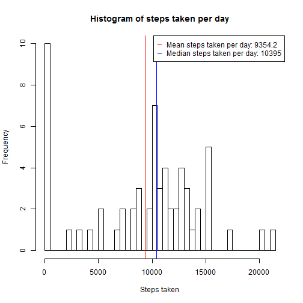
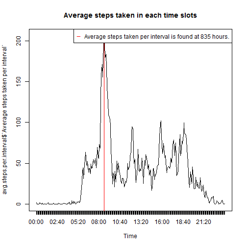
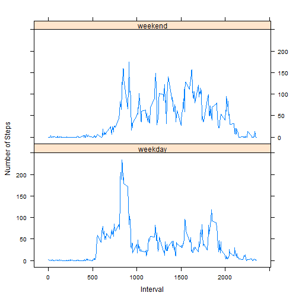

## Loading and preprocessing the data
1. Load the data

```r
input <- read.csv("activity.csv")
```
2. Inspect the data to be correct

```r
head(input)
```

```
##   steps       date interval
## 1    NA 2012-10-01        0
## 2    NA 2012-10-01        5
## 3    NA 2012-10-01       10
## 4    NA 2012-10-01       15
## 5    NA 2012-10-01       20
## 6    NA 2012-10-01       25
```

```r
str(input)
```

```
## 'data.frame':	17568 obs. of  3 variables:
##  $ steps   : int  NA NA NA NA NA NA NA NA NA NA ...
##  $ date    : Factor w/ 61 levels "2012-10-01","2012-10-02",..: 1 1 1 1 1 1 1 1 1 1 ...
##  $ interval: int  0 5 10 15 20 25 30 35 40 45 ...
```

## What is mean total number of steps taken per day?
1. Make a histogram of the total number of steps taken each day

```r
library(dplyr)
step_by_day <-
  summarize(group_by(input, date),
            sum(steps, na.rm=TRUE))
colnames(step_by_day)[2] <- "steps"
```
2. Calculate and report the mean and median total number of steps taken per day

```r
hist(step_by_day$steps,
     breaks = 32,
     main = "Histogram of steps taken per day",
     xlab = "Steps taken")

mean.steps.per.day <- round(mean(step_by_day$steps), 1)
median.steps.per.day <- median(step_by_day$steps)

abline(v=mean.steps.per.day, col=2)
abline(v=median.steps.per.day, col=4)
legend(x="topright",
       legend =
         c(paste("Mean steps taken per day:", mean.steps.per.day), 
           paste("Median steps taken per day:", median.steps.per.day)),
       col = c(2,4),
       pch = "__"
)
```


## What is the average daily activity pattern?
1. Make a time series plot (i.e. type = "l") of the 5-minute interval (x-axis) and the average number of steps taken, averaged across all days (y-axis)

```r
avg.steps.per.interval <- 
  summarise(group_by(input, interval),
            mean = mean(steps, na.rm = TRUE))
colnames(avg.steps.per.interval)[2] <- "Average steps taken per interval"
time.series.names <- 
  strftime(as.POSIXlt(seq(from = 0, to = 24 * 3600 - 5*60, by = 5 * 60),
                      origin="2016-01-01 00:00:00",
                      tz="UTC"), 
           format="%H:%M", 
           tz="UTC")
```
2. Which 5-minute interval, on average across all the days in the dataset, contains the maximum number of steps?

```r
plot(x = c(1:288),
  y = avg.steps.per.interval$`Average steps taken per interval`,
  type = "l",
  main = "Average steps taken in each time slots",
  xlab = "Time",
  xaxt = "n")
axis(1, at=c(1:288/12) * 12, labels=time.series.names)
max.steps.record <- 
  filter(avg.steps.per.interval,
         `Average steps taken per interval`==
           max(avg.steps.per.interval$`Average steps taken per interval`, 
               na.rm=TRUE))
vpos <- (max.steps.record$interval %% 100) / 5 + floor(max.steps.record$interval / 100) * 12 + 1
abline(v=vpos, col=2)
legend(x="topright",
       legend =
         paste("Average steps taken per interval is found at",
               max.steps.record$interval,
               "hours."),
       col = 2,
       pch = "_"
)
```


## Imputing missing values
Note that there are a number of days/intervals where there are missing values (coded as NA). The presence of missing days may introduce bias into some calculations or summaries of the data.

1. Calculate and report the total number of missing values in the dataset (i.e. the total number of rows with NAs)

```r
num.of.missing.values <- length(input$steps[which(is.na(input$steps))])
print(paste("Number of missing values is:", num.of.missing.values))
```

```
## [1] "Number of missing values is: 2304"
```
2. Devise a strategy for filling in all of the missing values in the dataset. The strategy does not need to be sophisticated. For example, you could use the mean/median for that day, or the mean for that 5-minute interval, etc.
The NA data is substitute with average steps from the same 5 minute interval over each day.

```r
input$avg.steps.at.interval <- 
  sapply(input$interval, 
         function(x) {input$steps.avg.per.interval <- 
           filter(avg.steps.per.interval, interval == x)$`Average steps taken per interval`})
replace.na = function(x, y) {
  if (is.na(x)) {
    return (y)
  } else {
    return (x)
  }
}
input$steps.na.removed <- input$steps
input$steps.na.removed <-
  mapply(replace.na,
  input$steps.na.removed,
  input$avg.steps.at.interval
  )
```
3. Create a new dataset that is equal to the original dataset but with the missing data filled in.

```r
input_new <- input
input_new$avg.steps.at.interval <- NULL
input_new$steps.na.removed <- NULL
```
4. Make a histogram of the total number of steps taken each day and Calculate and report the mean and median total number of steps taken per day. Do these values differ from the estimates from the first part of the assignment? What is the impact of imputing missing data on the estimates of the total daily number of steps?
Answer: There is almost no difference, as the data is completed by substituting NA values with the average value of the same 5 minutes interval over each days.

```r
step_by_day_new <-
  summarize(group_by(input_new, date),
            sum(steps, na.rm=TRUE))
colnames(step_by_day_new)[2] <- "steps"
hist(step_by_day_new$steps,
     breaks = 32,
     main = "Histogram of steps taken per day",
     xlab = "Steps taken")

mean.steps.per.day <- round(mean(step_by_day_new$steps), 1)
median.steps.per.day <- median(step_by_day_new$steps)

abline(v=mean.steps.per.day, col=2)
abline(v=median.steps.per.day, col=4)
legend(x="topright",
       legend =
         c(paste("Mean steps taken per day:", mean.steps.per.day), 
           paste("Median steps taken per day:", median.steps.per.day)),
       col = c(2,4),
       pch = "__"
)
```


## Are there differences in actFor this part the weekdays() function may be of some help here. Use the dataset with the filled-in missing values for this part.
1. Create a new factor variable in the dataset with two levels -- "weekday" and "weekend" indicating whether a given date is a weekday or weekend day.

```r
Sys.setlocale(local="USA")
```

```
## [1] "LC_COLLATE=English_United States.1252;LC_CTYPE=English_United States.1252;LC_MONETARY=English_United States.1252;LC_NUMERIC=C;LC_TIME=English_United States.1252"
```

```r
library(chron)
input_new$daytype <- 
  sapply(input_new$date, 
         function(x){
           if (is.weekend(as.Date(x))) 
             {return("weekend")} 
           else 
             {return("weekday")}})
```
2. Make a panel plot containing a time series plot (i.e. type = "l") of the 5-minute interval (x-axis) and the average number of steps taken, averaged across all weekday days or weekend days (y-axis).ivity patterns between weekdays and weekends?

```r
summary <- 
  summarise(
    group_by(input_new, interval, daytype), 
    mean.steps=mean(steps, na.rm=TRUE))
library(lattice)
xyplot(mean.steps~interval | daytype, data = summary,
       type = 'l',
       mean = 'Comparison chart of average steps per interval between weekdays and weekends',  
       xlab = 'Interval',
       ylab = 'Number of Steps',
       layout = c(1,2))
```


